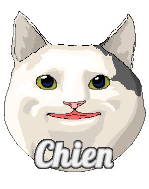

# Maximum Entropy Reinforcement Learning via Energy-Based Normalizing Flow

[](https://arxiv.org/abs/2405.13629) [](https://youtu.be/71-VtIWEPFw)
<br>

This repository contains the code implementation of the experiments presented in the paper [*Maximum Entropy Reinforcement Learning via Energy-Based Normalizing Flow*](https://arxiv.org/abs/2405.13629).

---

## Directory Structure
- Use the code in [meow/toy](/toy) to reproduce the experimental results presented in **Section 4.1** of [our paper](https://arxiv.org/abs/2405.13629).
- Use the code in [meow/cleanrl](/cleanrl) to reproduce the experimental results presented in **Section 4.2** of [our paper](https://arxiv.org/abs/2405.13629).
- Use the code in [meow/skrl](/skrl) to reproduce the experimental results presented in **Section 4.3** of [our paper](https://arxiv.org/abs/2405.13629).
- Use the code in [meow/plot](/plot) to reproduce the figures presented in [our paper](https://arxiv.org/abs/2405.13629).

---

## License

To maintain reproducibility, we freezed the released versions of following repositories and list their licenses as follows:
- [Toni-SM/skrl](https://github.com/Toni-SM/skrl) (at commit 631613a) is licensed under the MIT License.
- [vwxyzjn/cleanrl](https://github.com/vwxyzjn/cleanrl) (at commit 8cbca61) is licensed under the MIT License.
- [VincentStimper/normalizing-flows](https://github.com/VincentStimper/normalizing-flows/tree/master) (at commit 848277e) is licensed under the MIT License.
- [rail-berkeley/softlearning](https://github.com/rail-berkeley/softlearning) (at commit 13cf187) is licensed under the MIT License.

Further changes based on the repository above are licensed under the [MIT License](LICENSE).

---

## Cite this Repository

If you find this repository useful, please consider citing [our paper](https://arxiv.org/abs/2405.13629):

```bibtex
@inproceedings{chao2024maximum,
    title={Maximum Entropy Reinforcement Learning via Energy-Based Normalizing Flow},
    author={Chao, Chen-Hao and Feng, Chien and Sun, Wei-Fang and Lee, Cheng-Kuang and See, Simon and Lee, Chun-Yi},
    booktitle={Proceedings of the International Conference on Neural Information Processing Systems (NeurIPS)},
    year={2024}
}
```

---

## Contributors of the Code Implementation

[](https://github.com/ChienFeng-hub)
[](https://github.com/j3soon)
[](https://github.com/chen-hao-chao)

> Visit our GitHub pages by clicking the images above.