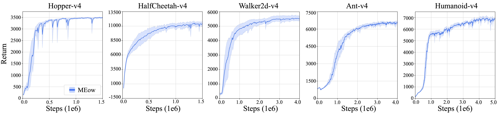
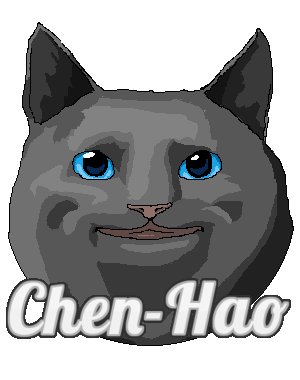

# MEow in CleanRL Implementation

[](https://arxiv.org/abs/2405.13629)<br>

[](https://paperswithcode.com/sota/openai-gym-on-hopper-v4?p=maximum-entropy-reinforcement-learning-via) [](https://paperswithcode.com/sota/openai-gym-on-halfcheetah-v4?p=maximum-entropy-reinforcement-learning-via) [](https://paperswithcode.com/sota/openai-gym-on-walker2d-v4?p=maximum-entropy-reinforcement-learning-via) [](https://paperswithcode.com/sota/openai-gym-on-ant-v4?p=maximum-entropy-reinforcement-learning-via) [](https://paperswithcode.com/sota/openai-gym-on-humanoid-v4?p=maximum-entropy-reinforcement-learning-via)

This folder contains the [Clean RL](https://github.com/vwxyzjn/cleanrl) implementation of [MEow](https://github.com/ChienFeng-hub/meow). CleanRL is a library that features single-file implementation of several widely-used online reinforcement learning algorithms. More details about CleanRL is provided in their [documentation](https://docs.cleanrl.dev/).

<p align="center">
  
</p>

---

## Install Dependencies

- Launch a docker image through the following commands:
```bash
# assume the current directory is the root of this repository
docker run --rm -it --gpus all --ipc=host -v ${PWD}:/app nvcr.io/nvidia/pytorch:20.12-py3
# inside the docker container, run:
cd /app
```

- Install the dependencies using the following commands:
```bash
# install the default dependencies
pip install --ignore-installed PyYAML
pip install -r requirements/requirements.txt --use-feature=2020-resolver
pip install -U gymnasium --use-feature=2020-resolver
pip install -r requirements/requirements-mujoco.txt

# install the ray tune package for parallelizable training
pip install ray[tune]
```

- It's okay to have the following error messages: 
```
ERROR: torchvision 0.9.0a0 requires torch==1.8.0a0+1606899, but you'll have torch 1.12.1 which is incompatible.
ERROR: stable-baselines3 2.0.0 requires gymnasium==0.28.1, but you'll have gymnasium 0.29.1 which is incompatible.
```

> NOTE: For more details or assistance with installation, please refer to [Clean RL's documentation](https://docs.cleanrl.dev/).

---

## Training Commands

### (Optional) Example
Use the following command to train PPO on the `CartPole-v1` environment:
```bash
python cleanrl/ppo.py --seed 1 --env-id CartPole-v1 --total-timesteps 50000
```

> NOTE: The results will be saved in the `./runs` directory. 
> NOTE: Launch `Tensorboard` to verify if the training was successful.

### MEow

#### Single Run on a GPU
```bash
# Hopper-v4
python cleanrl/meow_continuous_action.py --seed 1 --env-id Hopper-v4 --total-timesteps 1500000 --tau 0.005 --alpha 0.25 --learning-starts 5000 --sigma-max -0.3 --sigma-min -5.0 --deterministic_action
# HalfCheetah-v4
python cleanrl/meow_continuous_action.py --seed 1 --env-id HalfCheetah-v4 --total-timesteps 1500000 --tau 0.003 --alpha 0.25 --learning_starts 10000 --sigma_max 2.0 --sigma_min -5.0 --deterministic_action
# Walker2d-v4
python cleanrl/meow_continuous_action.py --seed 1 --env-id Walker2d-v4 --total-timesteps 4000000 --tau 0.005 --alpha 0.1 --learning-starts 10000 --sigma-max -0.3 --sigma-min -5.0 --deterministic_action
# Ant-v4
python cleanrl/meow_continuous_action.py --seed 1 --env-id Ant-v4 --total-timesteps 4000000 --tau 0.0001 --alpha 0.05 --learning_starts 5000 --sigma_max -0.3 --sigma_min -5.0 --deterministic_action
# Humanoid-v4
python cleanrl/meow_continuous_action.py --seed 1 --env-id Humanoid-v4 --total-timesteps 5000000 --tau 0.0005 --alpha 0.125 --learning_starts 5000 --sigma_max -0.3 --sigma_min -5.0 --deterministic_action
```

#### Parallelizable Training using Ray Tune
```bash
# Hopper-v4
python tuner_meow_hopper.py
# HalfCheetah-v4
python tuner_meow_halfcheetah.py
# Walker2d-v4
python tuner_meow_walker.py
# Ant-v4
python tuner_meow_ant.py
# Humanoid-v4
python tuner_meow_humanoid.py
```

> NOTE: Adjust the `gpu` setting in `resources_per_trial` on line 63 of the tuner code to modify the throughput. For example, setting `'gpu': 0.25` allows for the simultaneous training of four different runs.

---

## Evaluation Results

Most of the evaluation results presented in the paper can be found [here](../plot). Read [our instruction](../plot) for reproducing the plots presented in [our paper](https://arxiv.org/abs/2405.13629). The results of the baseline algorithms (i.e., SAC, DDPG, TD3, PPO) can be reproduced using [Stable Baseline 3](https://github.com/DLR-RM/stable-baselines3) with its refined hyperparameters (i.e., [RL Baselines3 Zoo](https://github.com/DLR-RM/rl-baselines3-zoo)). The results of the SQL algorithm can be reproduced via [ChienFeng-hub/softqlearning-pytorch](https://github.com/ChienFeng-hub/softqlearning-pytorch).

---

## References

This code implementation is developed based on the following repositories:
- [vwxyzjn/cleanrl](https://github.com/vwxyzjn/cleanrl) (at commit 8cbca61) is licensed under the MIT License.
- [VincentStimper/normalizing-flows](https://github.com/VincentStimper/normalizing-flows/tree/master) (at commit 848277e) is licensed under the MIT License.

---

## Cite this Repository

If you find this repository useful, please consider citing [our paper](https://arxiv.org/abs/2405.13629):

```bibtex
@inproceedings{chao2024maximum,
    title={Maximum Entropy Reinforcement Learning via Energy-Based Normalizing Flow},
    author={Chao, Chen-Hao and Feng, Chien and Sun, Wei-Fang and Lee, Cheng-Kuang and See, Simon and Lee, Chun-Yi},
    booktitle={Proceedings of the International Conference on Neural Information Processing Systems (NeurIPS)},
    year={2024}
}
```

---

## Contributors of the Code Implementation

[](https://github.com/ChienFeng-hub)
[](https://github.com/j3soon)
[](https://github.com/chen-hao-chao)

> Visit our GitHub pages by clicking the images above.