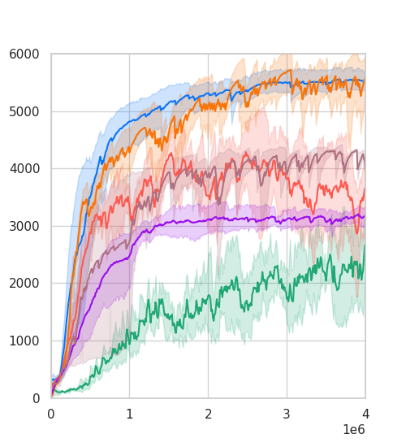

# Reproducing the Plots Presented in Our Paper

[](https://arxiv.org/abs/2405.13629)<br>

This folder contains the code implementation for the plots presented in [our paper](https://arxiv.org/abs/2405.13629).

---

## Install Dependencies

- Launch a docker image through the following commands:
```bash
# assume the current directory is the root of this repository
docker run --rm -it --gpus all --ipc=host -v ${PWD}:/app nvcr.io/nvidia/pytorch:20.12-py3
# inside the docker container, run:
cd /app
```

- Install `conda`, create a conda envrionment `meow`, and activate it:
```bash
conda create --name meow python=3.8 -y
source activate
conda activate meow
```

- Install the dependencices for plotting:
```bash
pip install tbparse
pip install seaborn
```

---

## Evaluation Results
Most of the evaluation results presented in the paper are provided in the following table:

| # | Experiment | Position in the Paper | Environment | File |
| -- | ---------- | --------------------- | ----------- | ---- |
| 1 | Return Comparison                    | Fig. 3        | MuJoCo                     | [results.zip](https://drive.google.com/file/d/1ZKAq9GMvgwpDL9UOHYTJltl50znsj3Bl/view?usp=sharing) |
| 2 | Return Comparison                    | Fig. 4        | Omniverse Isaac Gym        | [results.zip](https://drive.google.com/file/d/1-zPf9zB1Xyb_Po0NWBGoBd_Xcbnclzua/view?usp=sharing) |
| 3 | Ablation Analysis (LRS & SCDQ)       | Fig. 6        | MuJoCo                     | [results.zip](https://drive.google.com/file/d/1_7drrQsguzZGBmn9jXDNZHTt3uaeyAF5/view?usp=sharing) |
| 4 | Ablation Analysis (Deterministic)    | Fig. 7        | MuJoCo                     | [results.zip](https://drive.google.com/file/d/1IzH1l60HpF3JmLw-SrBWSc17zO0aS9Tv/view?usp=sharing) |
| 5 | Ablation Analysis (Affine)           | Fig. A1       | MuJoCo                     | [results.zip](https://drive.google.com/file/d/1H1QgeueVQKX9MhuSeigPJVel7c5EfkSE/view?usp=sharing) |
| 6 | Ablation Analysis (Parameterization) | Fig. A2       | MuJoCo                     | [results.zip](https://drive.google.com/file/d/1DLxfgIuPQ-mBLwWs1QaJVAdbSNrqByjW/view?usp=sharing) |
| 7 | Ablation Analysis (SAC+LRS)          | Fig. A4       | MuJoCo                     | [results.zip](https://drive.google.com/file/d/1ML222wKF84-5NvqQi3hnXy0Pl5nJ8MWj/view?usp=sharing) |

- Download `results.zip` and unzip it. You will obtain a directory called `smoothed` that contains the (smoothed) results evaluated in various environments. This directory has a nested structure organized by `${name_of_env}` and `${name_of_algorithm}`. For example, the results of the `#1` experiment presented in the above table are arranged as follows:

```
smoothed/
    ├── Ant-v4/
    |    ├── meow/
    |    |    ├── 1/
    |    |    |   └── ${tfevents_log}
    |    |    ├── 2/
    |    |    ├── 3/
    |    |    ├── 4/
    |    |    └── 5/
    |    ├── ddpg/
    |    ├── ppo/
    |    ├── td3/
    |    ├── sql/
    |    └── sac/
    ├── HalfCheetah-v4/
    ├── Hopper-v4/
    ├── Humanoid-v4/
    └── Walker2d-v4/
```

---

## Plotting

- Place the `smoothed` directory in the current folder and execute the plotting commands (i.e., `plot_fig_${num}.py`). For example, each subfigure of Fig. 3 in the paper can be reproduced using the following command:
```
python plot_fig_3.py
```

- You may obtain the following figures stored at a directory named `fig_3`.
<p align="center">
  
  
  
  
  
</p>

> NOTE: The smoothing method for these curves is the same as that implemented in `Tensorboard`. Please open an issue if you need the code implementation for the smoothing method.

---

## Cite this Repository

If you find this repository useful, please consider citing [our paper](https://arxiv.org/abs/2405.13629):

```bibtex
@inproceedings{chao2024maximum,
    title={Maximum Entropy Reinforcement Learning via Energy-Based Normalizing Flow},
    author={Chao, Chen-Hao and Feng, Chien and Sun, Wei-Fang and Lee, Cheng-Kuang and See, Simon and Lee, Chun-Yi},
    booktitle={Proceedings of the International Conference on Neural Information Processing Systems (NeurIPS)},
    year={2024}
}
```

---

## Contributors of the Code Implementation

[](https://github.com/ChienFeng-hub)
[](https://github.com/j3soon)
[](https://github.com/chen-hao-chao)

> Visit our GitHub pages by clicking the images above.