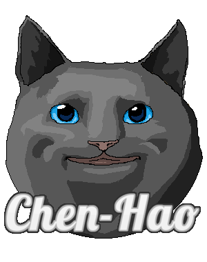

# MEow in SKRL Implementation

[](https://arxiv.org/abs/2405.13629)<br>

[](https://paperswithcode.com/sota/omniverse-isaac-gym-on-ant?p=maximum-entropy-reinforcement-learning-via) [](https://paperswithcode.com/sota/omniverse-isaac-gym-on-humanoid?p=maximum-entropy-reinforcement-learning-via) [](https://paperswithcode.com/sota/omniverse-isaac-gym-on-ingenuity?p=maximum-entropy-reinforcement-learning-via) [](https://paperswithcode.com/sota/omniverse-isaac-gym-on-anymal?p=maximum-entropy-reinforcement-learning-via) [](https://paperswithcode.com/sota/omniverse-isaac-gym-on-allegrohand?p=maximum-entropy-reinforcement-learning-via) [](https://paperswithcode.com/sota/omniverse-isaac-gym-on-frankacabinet?p=maximum-entropy-reinforcement-learning-via)


This folder contains the implementation of [MEow](https://github.com/ChienFeng-hub/meow) based on [SKRL](https://github.com/Toni-SM/skrl). SKRL is a library that is compatible with the [NVIDIA Omniverse Isaac Gym](https://docs.omniverse.nvidia.com/isaacsim/latest/tutorial_gym_isaac_gym.html) environments. NVIDIA Omniverse Isaac Gym enables agents' simultaneous training of several robotics tasks simulated based on real-world applications. More details about SKRL and NVIDIA Omniverse Isaac Gym are provided in their documentations (i.e., [SKRL](https://skrl.readthedocs.io/en/latest/index.html) and [Isaac Sim](https://docs.omniverse.nvidia.com/isaacsim/latest/installation/install_container.html)).

<p align="center">
  
</p>

---

## Install Dependencies

### Prerequisites

- (1) Ensure you have `NVIDIA RTX` GPUs, as the following installation commands are based on this hardware setup.

- (2) Clone both meow and [OmniIsaacGymEnvs](https://github.com/NVIDIA-Omniverse/OmniIsaacGymEnvs), and arrange them as follows:

```
meow/
  ├── ...
  ├── skrl/
  └── OmniIsaacGymEnvs/
```

> NOTE: The following installation instructions are based on the `release/2023.1.1` version of `OmniIsaacGymEnvs`. Revert to this version using `git reset --hard release/2023.1.1`.

- (3) Download the docker image using the following commands:
```bash
# login to NGC
docker login nvcr.io
```

Enter `$oauthtoken` as the username, and enter [NGC API Key](https://docs.nvidia.com/ngc/gpu-cloud/ngc-user-guide/index.html#generating-api-key) as the password. For more details regarding the login instructions, please refer to Steps 4 and 5 of [NVIDIA's documentation](https://docs.omniverse.nvidia.com/isaacsim/latest/installation/install_container.html).
```
Username: $oauthtoken
Password: ${api_key}
```

After logging in, pull the Docker image using the following command.
```bash
docker pull nvcr.io/nvidia/isaac-sim:2023.1.1
```

> NOTE: The above steps (i.e., (1)~(3)) are needed to be performed only at the first time.

### Docker and Installation

- (1) Launch a docker image through the following commands at `./meow`:
```bash
docker run --name isaac-sim --entrypoint bash -it --gpus all -e "ACCEPT_EULA=Y" --rm --network=host \
    -e "PRIVACY_CONSENT=Y" \
    -v ~/docker/isaac-sim/cache/kit:/isaac-sim/kit/cache:rw \
    -v ~/docker/isaac-sim/cache/ov:/root/.cache/ov:rw \
    -v ~/docker/isaac-sim/cache/pip:/root/.cache/pip:rw \
    -v ~/docker/isaac-sim/cache/glcache:/root/.cache/nvidia/GLCache:rw \
    -v ~/docker/isaac-sim/cache/computecache:/root/.nv/ComputeCache:rw \
    -v ~/docker/isaac-sim/logs:/root/.nvidia-omniverse/logs:rw \
    -v ~/docker/isaac-sim/data:/root/.local/share/ov/data:rw \
    -v ~/docker/isaac-sim/documents:/root/Documents:rw \
    -v $(pwd):/workspace \
    -v /tmp/.X11-unix:/tmp/.X11-unix \
    -e DISPLAY=$DISPLAY \
    nvcr.io/nvidia/isaac-sim:2023.1.1
```

- (2) Install the dependencies using the following commands:
```bash
# re-path the python command
alias PYTHON_PATH=/isaac-sim/python.sh
# install the default dependencies of OmniIsaacGymEnvs
cd /workspace/OmniIsaacGymEnvs/
PYTHON_PATH -m pip install -e .

# install the default dependencies of meow/skrl
cd /workspace/skrl
PYTHON_PATH -m pip install --upgrade pip
PYTHON_PATH -m pip install -e .["torch"]
apt-get update && apt-get install -y libglib2.0-0 libsm6 libxrender1 libxext6

# install the ray tune package for parallelizable training / tuning
PYTHON_PATH -m pip install ray[tune]
```

- (3) Replace the `vec_env_base.py` file in `isaac-sim`:
```bash
cp /workspace/skrl/thirdparty/vec_env_base.py /isaac-sim/exts/omni.isaac.gym/omni/isaac/gym/vec_env/vec_env_base.py
```

> NOTE: Ensure that the `/workspace/skrl/runs` directory is removed during installation. If necessary, remove it using `rm -rf /workspace/skrl/runs`.

---

## Commands for Training

Use the following commands to reproduce the results of SAC and MEow.

### SAC
- Train SAC on the `AllegroHand` environment using the default configuration with the following command:
```bash
PYTHON_PATH trainer_sac.py
```
> NOTE: You may adjust the training configuration (e.g., `num_envs`, `memory_size`, and `directory`) in the `main()` function in `trainer_sac.py`.

> NOTE: To terminate the job, please use `kill -9 ${PID}`.

- Parallelizable training using [Ray Tune](https://docs.ray.io/en/latest/tune/index.html):
```bash
# AllegroHand
PYTHON_PATH tuner_sac_allegro.py
# Ant
PYTHON_PATH tuner_sac_ant.py
# ANYmal
PYTHON_PATH tuner_sac_anymal.py
# FrankaCabinet
PYTHON_PATH tuner_sac_franka.py
# Humanoid
PYTHON_PATH tuner_sac_humanoid.py
# Ingenuity
PYTHON_PATH tuner_sac_ingenuity.py
```

> NOTE: If you encounter the error message `Exception: Failed to create simulation view backend`, please clean up the cache by running `sh clean_cache.sh`.

### MEow
- Train MEow on the `AllegroHand` environment using the default configuration with the following command:
```bash
PYTHON_PATH trainer_meow.py
```

> NOTE: You may adjust the training configuration (e.g., `num_envs`, `memory_size`, and `directory`) in the `main()` function in `trainer_meow.py`.

> NOTE: To terminate the job, please use `kill -9 ${PID}`.

- Parallelizable training using [Ray Tune](https://docs.ray.io/en/latest/tune/index.html):
```bash
# AllegroHand
PYTHON_PATH tuner_meow_allegro.py
# Ant
PYTHON_PATH tuner_meow_ant.py
# ANYmal
PYTHON_PATH tuner_meow_anymal.py
# FrankaCabinet
PYTHON_PATH tuner_meow_franka.py
# Humanoid
PYTHON_PATH tuner_meow_humanoid.py
# Ingenuity
PYTHON_PATH tuner_meow_ingenuity.py
```

> NOTE: If you encounter the error message `Exception: Failed to create simulation view backend`, please clean up the cache by running `sh clean_cache.sh`.

---

## Demonstration

The following table presents the demonstration videos of MEow during inference time:

<div align="center">

|     Ant     |   Humanoid  |
| ----------- | ----------- |
|  |  |

|   Ingenuity   |    ANYmal   |
| ------------- | ----------- |
|  |  |

| AllegroHand | FrankaCabinet |
| ----------- | ------------- |
|  |  |

</div>

---

## Evaluation Results

Most of the evaluation results presented in the paper can be found [here](../plot). Read [our instruction](../plot) for reproducing the plots presented in [our paper](https://arxiv.org/abs/2405.13629).

---

## References

This code implementation is developed based on the following repositories:
- [Toni-SM/skrl](https://github.com/Toni-SM/skrl) (at commit 631613a) is licensed under the MIT License.
- [VincentStimper/normalizing-flows](https://github.com/VincentStimper/normalizing-flows/tree/master) (at commit 848277e) is licensed under the MIT License.

---

## Cite this Repository

If you find this repository useful, please consider citing [our paper](https://arxiv.org/abs/2405.13629):

```bibtex
@misc{chao2024maximum,
      title={{Maximum Entropy Reinforcement Learning via Energy-Based Normalizing Flow}}, 
      author={Chen-Hao Chao and Chien Feng and Wei-Fang Sun and Cheng-Kuang Lee and Simon See and Chun-Yi Lee},
      year={2024},
      eprint={2405.13629},
      archivePrefix={arXiv},
      primaryClass={cs.LG}
}
```

---

## Contributors of the Code Implementation

[](https://github.com/ChienFeng-hub)
[](https://github.com/j3soon)
[](https://github.com/chen-hao-chao)

> Visit our GitHub pages by clicking the images above.