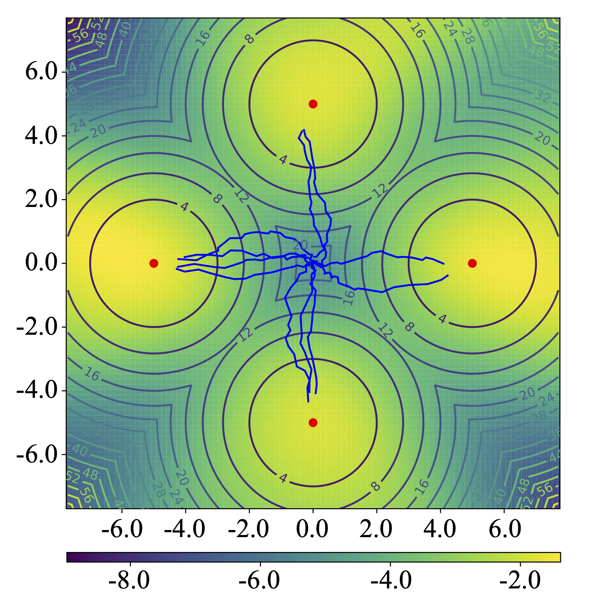

# Two-Dimensional Toy Example of MEow

[](https://arxiv.org/abs/2405.13629)<br>

This folder contains the code implementation of the toy experiments in Section 4.1 of [our paper](https://arxiv.org/abs/2405.13629).

<p align="center">
  
</p>

---

## Install Dependencies

- Launch a docker image through the following commands:
```bash
# assume the current directory is the root of this repository
docker run --rm -it --gpus all --ipc=host -v ${PWD}:/app nvcr.io/nvidia/pytorch:20.12-py3
# inside the docker container, run:
cd /app
```

- Install `conda`, create a conda envrionment `meow`, and activate it:
```bash
conda create --name meow python=3.8 -y
source activate
conda activate meow
```

-  Install the dependencies using the following commands:
```bash
pip install -r requirements.txt
```

---

## Commands

- Train MEow using the following command:
```
python train.py config=multigoal/meow.yaml
```
 
- Visualize MEow's sampling trajectories using the following command:
```
python plot_multigoal_value.py config=multigoal/meow.yaml path_load=ckpts/MultiGoal-v0/meow/base/1-seed0/best.pt
```

> NOTE: Replace `path_load` with the checkpoint's location.

---

## References

This code implementation is developed based on the following repositories:
- [VincentStimper/normalizing-flows](https://github.com/VincentStimper/normalizing-flows/tree/master) (at commit 848277e) is licensed under the MIT License.
- [rail-berkeley/softlearning](https://github.com/rail-berkeley/softlearning) (at commit 13cf187) is licensed under the MIT License.

---

## Cite this Repository

If you find this repository useful, please consider citing [our paper](https://arxiv.org/abs/2405.13629):

```bibtex
@inproceedings{chao2024maximum,
    title={Maximum Entropy Reinforcement Learning via Energy-Based Normalizing Flow},
    author={Chao, Chen-Hao and Feng, Chien and Sun, Wei-Fang and Lee, Cheng-Kuang and See, Simon and Lee, Chun-Yi},
    booktitle={Proceedings of the International Conference on Neural Information Processing Systems (NeurIPS)},
    year={2024}
}
```

---

## Contributors of the Code Implementation

[](https://github.com/ChienFeng-hub)
[](https://github.com/j3soon)
[](https://github.com/chen-hao-chao)

> Visit our GitHub pages by clicking the images above.